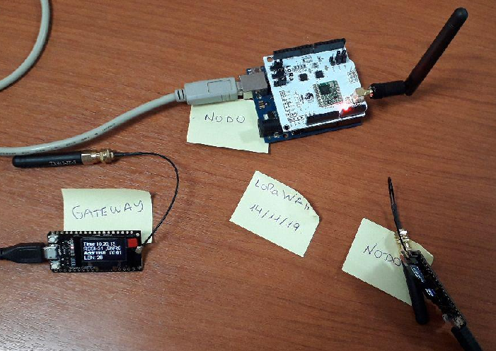
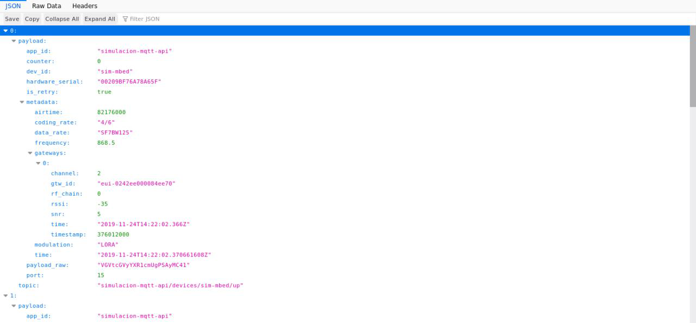
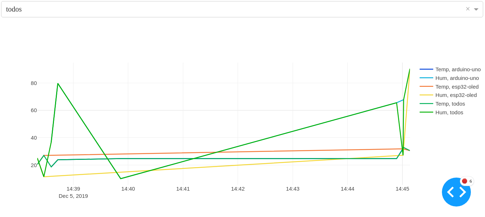
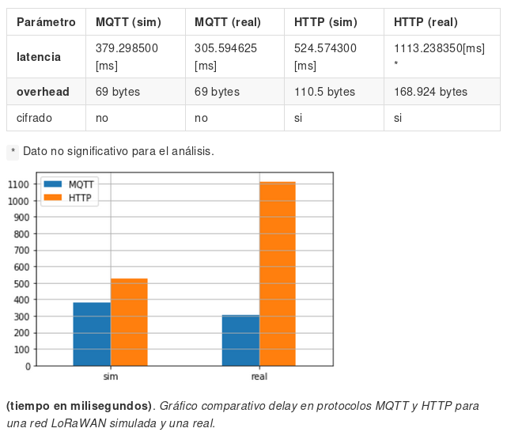
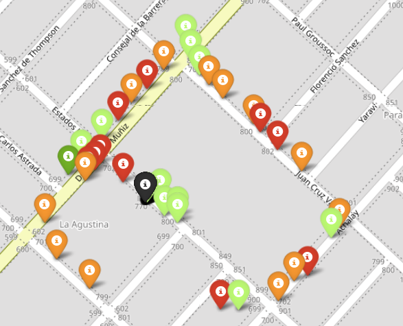

# LoRa/LoRaWAN step by step

This projects allow you to test LoRa/LoRaWAN networks from scratch, starting with a point to point LoRa communication, then a little LoRaWAN network using two [ESP32 Oled LoRa](http://www.lilygo.cn/prod_view.aspx?TypeId=50003&Id=1137&FId=t3:50003:3) and an [arduino-uno](https://store.arduino.cc/usa/arduino-uno-rev3)

## Hardware

* [ESP32 Oled LoRa](http://www.lilygo.cn/prod_view.aspx?TypeId=50003&Id=1137&FId=t3:50003:3)
* [arduino-uno](https://store.arduino.cc/usa/arduino-uno-rev3)

## Projects

* **esp32 lora point to point** *(0, 1)*
* **esp32 and arduino uno lorawan** *(2, 3, 4)*
* **api from mqtt client** *(5)*
* **real time plot with dash** *(5)*
* **study of delay and overhead in mqtt vs http** *(6)*
* **coverage map**. *(7)*

## Development and deploy environment

[VS Code](https://go.microsoft.com/fwlink/?LinkID=760868)

[PlatformIO IDE](https://platformio.org/install/ide?install=vscode)

[Jupyterlab](https://jupyterlab.readthedocs.io/en/stable/)

## Instructions

* **[Download and install VSCode](https://code.visualstudio.com/Download)**
* **[Download and install Platformio](https://docs.platformio.org/en/latest/ide/vscode.html)**
* **[Download and install Python3](https://www.python.org/downloads/)**

To **get started** with LoRa, go to `0.oled_lora_sender` and `1.oled_lora_reciever` that code allows you test point to point LoRa connection with two [ESP32 Oled LoRa](http://www.lilygo.cn/prod_view.aspx?TypeId=50003&Id=1137&FId=t3:50003:3).

Then, you can build a one gateway and two nodes LoRaWAN network using  `2.esp32_single_channel_lora_gateway`, `3.esp32_single_channel_lora_node` and `4.arduino_uno_lora_node`.

For each project, from VSCode and `PIO Home`, click in `Open project` option, open the `.ino` file for each project, press `Ctrl + Alt + B`, with ESP32/Arduino connected, press `Ctrl + Alt + u`.

## Documentation (spanish)

* [Prototipo de red LoRaWAN para solución IoT](https://hackmd.io/@WeoNqa30RGeTczMlJlM58Q/BJ0ysrHHB)
* [Anexos](https://hackmd.io/@WeoNqa30RGeTczMlJlM58Q/BkFotNsYH)
* [¿MQTT o HTTP? En una red LoRaWAN](https://hackmd.io/@WeoNqa30RGeTczMlJlM58Q/SkqFx7isr)
